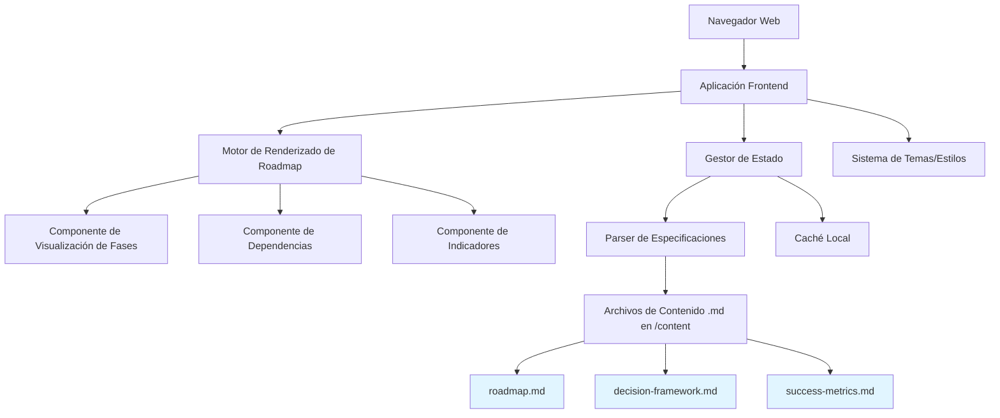
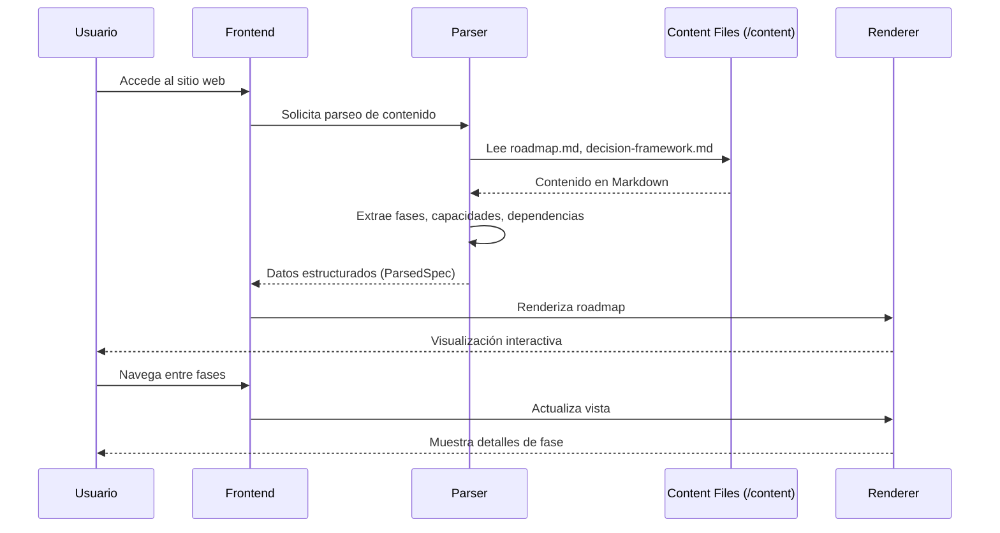
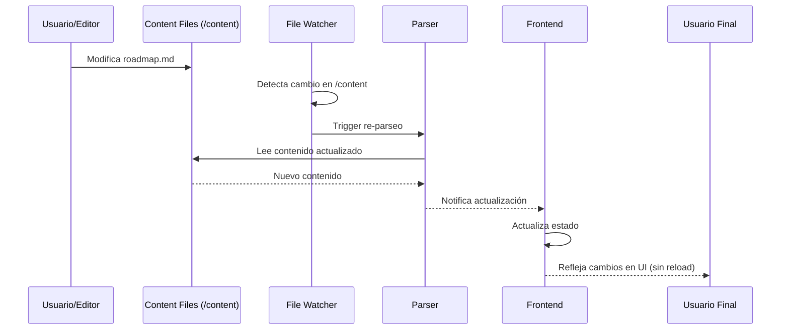

# Documento de Diseño: Platform Leadership Challenge Roadmap

## Resumen General

Sistema web interactivo para visualizar y gestionar el roadmap de un reto técnico de liderazgo en ingeniería de plataforma. El sistema presenta de manera visual y gerencial las fases del proyecto Backstage, capacidades a entregar, dependencias, criterios de transición, marco de decisión e indicadores de éxito. La arquitectura está diseñada para actualizarse dinámicamente conforme se modifican las especificaciones del proyecto, permitiendo una presentación ejecutiva clara y profesional.

El sistema se centra en tres pilares fundamentales: visualización intuitiva del roadmap por fases, gestión dinámica del contenido basado en especificaciones estructuradas, y presentación gerencial orientada a stakeholders ejecutivos.

## Estructura del Proyecto

```
platform-leadership-challenge-roadmap/
├── .kiro/specs/platform-leadership-challenge-roadmap/
│   ├── design.md              # Diseño técnico del sistema (este documento)
│   ├── requirements.md         # Requisitos funcionales y no funcionales
│   └── tasks.md               # Tareas de implementación
├── content/                   # Contenido del roadmap (parseado por la app)
│   ├── README.md              # Guía de formato y uso
│   ├── roadmap.md             # Roadmap principal con fases y capacidades
│   ├── decision-framework.md  # Marco de decisión (flexible vs no negociable)
│   ├── success-metrics.md     # Indicadores de éxito (opcional)
│   └── people-actions.md      # Acciones para stakeholders (opcional)
├── src/                       # Código fuente de la aplicación
│   ├── components/            # Componentes React
│   ├── parsers/               # Lógica de parseo de Markdown
│   ├── state/                 # Gestión de estado
│   └── utils/                 # Utilidades
└── public/                    # Assets estáticos
```

**Separación Clara de Responsabilidades**:
- **Specs** (`.kiro/specs/`): Documentación técnica del SISTEMA (cómo funciona la app)
- **Content** (`content/`): Contenido del ROADMAP (qué se presenta en la app)
- **Source** (`src/`): Código de implementación de la aplicación

## Arquitectura



**Separación de Responsabilidades**:
- **Specs del Sistema** (`.kiro/specs/platform-leadership-challenge-roadmap/`): Define CÓMO funciona la aplicación (diseño técnico, requisitos, tareas)
- **Contenido del Roadmap** (`content/`): Define QUÉ se presenta (fases del proyecto Backstage, capacidades, decisiones, métricas)

## Diagramas de Secuencia

### Flujo Principal: Carga y Visualización del Roadmap



### Flujo de Actualización Dinámica



## Componentes e Interfaces

### Componente 1: SpecParser

**Propósito**: Parsear archivos Markdown de especificaciones y extraer información estructurada sobre fases, capacidades, dependencias y criterios.

**Interfaz**:
```typescript
interface SpecParser {
  parseSpecFile(filePath: string): Promise<ParsedSpec>
  extractPhases(content: string): Phase[]
  extractCapabilities(content: string): Capability[]
  extractDependencies(content: string): Dependency[]
  extractDecisionFramework(content: string): DecisionFramework
  extractSuccessMetrics(content: string): SuccessMetric[]
}
```

**Responsabilidades**:
- Leer y parsear archivos Markdown con formato específico desde el directorio `content/`
- Extraer metadatos estructurados de las secciones del documento
- Validar integridad de las dependencias entre fases
- Generar estructura de datos normalizada para el frontend

**Formato de Entrada Esperado**:
Los archivos Markdown en `content/` deben seguir esta estructura:

```markdown
## Fase N: Nombre de la Fase
**ID**: phase-n
**Estado**: not_started | in_progress | completed | blocked
**Duración estimada**: X meses

### Capacidades a Entregar
#### CAP-N.M: Nombre de la Capacidad
**Prioridad**: critical | high | medium | low
**Estado**: planned | in_progress | completed | deferred
**Descripción**: Descripción detallada
**Entregables**: Lista de entregables
**Esfuerzo estimado**: Tiempo estimado
**Dependencias**: IDs de capacidades de las que depende

### Criterios de Transición a Fase N+1
- ✓ Criterio 1
- ✓ Criterio 2
```

El parser extrae esta información y la convierte en objetos `Phase` y `Capability`.

### Componente 2: RoadmapRenderer

**Propósito**: Renderizar visualmente el roadmap con fases, líneas de tiempo y dependencias de manera intuitiva y gerencial.

**Interfaz**:
```typescript
interface RoadmapRenderer {
  renderTimeline(phases: Phase[]): ReactElement
  renderPhaseCard(phase: Phase): ReactElement
  renderDependencyGraph(dependencies: Dependency[]): ReactElement
  highlightCriticalPath(phases: Phase[]): void
  updatePhaseStatus(phaseId: string, status: PhaseStatus): void
}
```

**Responsabilidades**:
- Generar visualización de línea de tiempo horizontal o vertical
- Renderizar tarjetas de fase con información clave
- Dibujar conexiones visuales entre dependencias
- Resaltar ruta crítica del proyecto
- Actualizar estados visuales en tiempo real

### Componente 3: StateManager

**Propósito**: Gestionar el estado global de la aplicación, incluyendo datos parseados, filtros activos y estado de navegación.

**Interfaz**:
```typescript
interface StateManager {
  loadSpecs(): Promise<void>
  getPhases(): Phase[]
  getPhaseById(id: string): Phase | null
  setActivePhase(phaseId: string): void
  getActivePhase(): Phase | null
  subscribeToChanges(callback: StateChangeCallback): Unsubscribe
  applyFilters(filters: FilterCriteria): void
}
```

**Responsabilidades**:
- Mantener estado centralizado de la aplicación
- Proveer acceso reactivo a los datos
- Gestionar navegación entre vistas
- Aplicar filtros y búsquedas
- Notificar cambios a componentes suscritos

### Componente 4: DashboardView

**Propósito**: Vista principal que presenta el resumen ejecutivo del roadmap con métricas clave e indicadores de progreso.

**Interfaz**:
```typescript
interface DashboardView {
  renderExecutiveSummary(): ReactElement
  renderPhaseOverview(): ReactElement
  renderSuccessMetrics(): ReactElement
  renderDecisionFramework(): ReactElement
  renderKeyActions(): ReactElement
}
```

**Responsabilidades**:
- Presentar vista de alto nivel del proyecto
- Mostrar indicadores de éxito y KPIs
- Visualizar marco de decisión
- Destacar acciones críticas relacionadas con personas
- Proveer navegación rápida a detalles

### Componente 5: PhaseDetailView

**Propósito**: Vista detallada de una fase específica con todas sus capacidades, dependencias y criterios de transición.

**Interfaz**:
```typescript
interface PhaseDetailView {
  renderPhaseHeader(phase: Phase): ReactElement
  renderCapabilitiesList(capabilities: Capability[]): ReactElement
  renderDependencies(dependencies: Dependency[]): ReactElement
  renderTransitionCriteria(criteria: TransitionCriteria[]): ReactElement
  renderArchitectureNotes(notes: string): ReactElement
}
```

**Responsabilidades**:
- Mostrar información completa de una fase
- Listar capacidades con descripciones y estados
- Visualizar dependencias entrantes y salientes
- Presentar criterios de transición a siguiente fase
- Incluir notas arquitectónicas relevantes

## Modelos de Datos

### Modelo 1: Phase

```typescript
interface Phase {
  id: string
  name: string
  description: string
  order: number
  status: PhaseStatus
  startDate?: Date
  endDate?: Date
  capabilities: Capability[]
  transitionCriteria: TransitionCriteria[]
  architectureNotes: string
  dependencies: string[]
}

enum PhaseStatus {
  NOT_STARTED = "not_started",
  IN_PROGRESS = "in_progress",
  COMPLETED = "completed",
  BLOCKED = "blocked"
}
```

**Reglas de Validación**:
- `id` debe ser único en todo el sistema
- `name` no puede estar vacío
- `order` debe ser un número positivo y secuencial
- `capabilities` debe contener al menos una capacidad
- `transitionCriteria` debe tener al menos un criterio para fases no finales

### Modelo 2: Capability

```typescript
interface Capability {
  id: string
  phaseId: string
  name: string
  description: string
  priority: Priority
  status: CapabilityStatus
  dependencies: string[]
  deliverables: string[]
  estimatedEffort?: string
}

enum Priority {
  CRITICAL = "critical",
  HIGH = "high",
  MEDIUM = "medium",
  LOW = "low"
}

enum CapabilityStatus {
  PLANNED = "planned",
  IN_PROGRESS = "in_progress",
  COMPLETED = "completed",
  DEFERRED = "deferred"
}
```

**Reglas de Validación**:
- `id` debe ser único globalmente
- `phaseId` debe referenciar una fase existente
- `name` y `description` no pueden estar vacíos
- `priority` debe ser uno de los valores del enum
- `dependencies` deben referenciar IDs de capacidades válidas

### Modelo 3: Dependency

```typescript
interface Dependency {
  id: string
  sourceId: string
  targetId: string
  type: DependencyType
  description: string
  isCritical: boolean
}

enum DependencyType {
  BLOCKS = "blocks",
  REQUIRES = "requires",
  ENABLES = "enables",
  INFLUENCES = "influences"
}
```

**Reglas de Validación**:
- `sourceId` y `targetId` deben referenciar entidades válidas (fases o capacidades)
- No pueden existir dependencias circulares
- `sourceId` y `targetId` no pueden ser iguales
- `type` debe ser uno de los valores del enum

### Modelo 4: DecisionFramework

```typescript
interface DecisionFramework {
  id: string
  flexible: DecisionArea[]
  nonNegotiable: DecisionArea[]
  escalationCriteria: string[]
  decisionMakers: Stakeholder[]
}

interface DecisionArea {
  area: string
  rationale: string
  constraints?: string[]
  alternatives?: string[]
}

interface Stakeholder {
  role: string
  responsibility: string
  decisionAuthority: string[]
}
```

**Reglas de Validación**:
- Debe haber al menos un área flexible y una no negociable
- `escalationCriteria` no puede estar vacío
- Cada `DecisionArea` debe tener `area` y `rationale` definidos
- `decisionMakers` debe incluir al menos un stakeholder

### Modelo 5: SuccessMetric

```typescript
interface SuccessMetric {
  id: string
  name: string
  description: string
  category: MetricCategory
  target: string
  current?: string
  measurementMethod: string
  frequency: MeasurementFrequency
}

enum MetricCategory {
  TECHNICAL = "technical",
  BUSINESS = "business",
  TEAM = "team",
  ADOPTION = "adoption"
}

enum MeasurementFrequency {
  DAILY = "daily",
  WEEKLY = "weekly",
  MONTHLY = "monthly",
  QUARTERLY = "quarterly",
  MILESTONE = "milestone"
}
```

**Reglas de Validación**:
- `name` debe ser único
- `target` debe ser medible y específico
- `measurementMethod` debe describir cómo se obtiene la métrica
- `category` debe ser uno de los valores del enum

### Modelo 6: ParsedSpec

```typescript
interface ParsedSpec {
  metadata: SpecMetadata
  phases: Phase[]
  decisionFramework: DecisionFramework
  successMetrics: SuccessMetric[]
  peopleActions: PeopleAction[]
  architectureOverview: string
}

interface SpecMetadata {
  title: string
  version: string
  lastUpdated: Date
  author?: string
}

interface PeopleAction {
  id: string
  stakeholder: string
  action: string
  rationale: string
  timing: string
  expectedOutcome: string
}
```

**Reglas de Validación**:
- `metadata.title` no puede estar vacío
- `phases` debe contener al menos una fase
- `lastUpdated` debe ser una fecha válida
- Todas las referencias entre entidades deben ser válidas

## Manejo de Errores

### Escenario 1: Archivo de Spec No Encontrado

**Condición**: El sistema intenta cargar un archivo de especificación que no existe o no es accesible.

**Respuesta**: 
- Mostrar mensaje de error amigable al usuario
- Registrar error en consola con detalles técnicos
- Ofrecer opción de cargar spec de ejemplo o crear nuevo

**Recuperación**: 
- Cargar estado por defecto con datos de ejemplo
- Permitir al usuario especificar ruta alternativa
- Continuar operación con datos en caché si están disponibles

### Escenario 2: Formato de Spec Inválido

**Condición**: El archivo de especificación existe pero no cumple con el formato esperado o tiene errores de sintaxis.

**Respuesta**:
- Identificar línea y sección con error
- Mostrar mensaje descriptivo del problema
- Resaltar sección problemática si es posible

**Recuperación**:
- Parsear secciones válidas y omitir las inválidas
- Mostrar advertencias sobre datos faltantes
- Proveer validador de formato para ayudar a corregir

### Escenario 3: Dependencias Circulares Detectadas

**Condición**: El análisis de dependencias revela ciclos que impedirían la ejecución secuencial del roadmap.

**Respuesta**:
- Identificar las entidades involucradas en el ciclo
- Visualizar el ciclo en un diagrama
- Alertar al usuario sobre la inconsistencia

**Recuperación**:
- Sugerir puntos de ruptura del ciclo
- Permitir visualización del roadmap con advertencia
- Deshabilitar validación de ruta crítica hasta resolver

### Escenario 4: Error de Renderizado

**Condición**: Fallo al renderizar un componente visual debido a datos inesperados o error de React.

**Respuesta**:
- Capturar error con Error Boundary
- Mostrar componente de fallback con mensaje amigable
- Registrar stack trace completo

**Recuperación**:
- Renderizar componentes hermanos que no fallaron
- Ofrecer botón de "Reintentar"
- Permitir navegación a otras secciones

## Consideraciones de Rendimiento

**Optimización de Parseo**:
- Implementar caché de specs parseados con invalidación basada en timestamp
- Usar Web Workers para parseo de archivos grandes sin bloquear UI
- Parseo incremental: solo re-parsear secciones modificadas

**Renderizado Eficiente**:
- Virtualización de listas largas de capacidades (react-window o similar)
- Memoización de componentes costosos con React.memo
- Lazy loading de vistas detalladas de fase
- Debouncing de búsquedas y filtros (300ms)

**Gestión de Estado**:
- Normalización de datos para evitar duplicación
- Selectores memoizados para derivar datos computados
- Actualizaciones inmutables para optimizar detección de cambios

**Métricas Objetivo**:
- Time to Interactive (TTI): < 2 segundos
- First Contentful Paint (FCP): < 1 segundo
- Parseo de spec típico (50 capacidades): < 100ms
- Renderizado de roadmap completo: < 500ms

## Consideraciones de Seguridad

**Validación de Entrada**:
- Sanitizar contenido Markdown para prevenir XSS
- Validar estructura de archivos antes de parsear
- Limitar tamaño máximo de archivos de spec (10MB)

**Acceso a Archivos**:
- Si se implementa carga de archivos locales, usar File API del navegador
- No ejecutar código arbitrario desde specs
- Validar extensiones de archivo permitidas (.md, .markdown)

**Protección de Datos**:
- No almacenar información sensible en localStorage sin encriptar
- Implementar Content Security Policy (CSP) restrictiva
- Usar HTTPS en producción

**Consideraciones para Deployment**:
- Si se despliega públicamente, considerar autenticación
- Rate limiting si hay endpoints de API
- Logs de auditoría para cambios en specs

## Dependencias

**Frontend Framework**:
- React 18+ (con hooks y concurrent features)
- TypeScript 5+ para type safety

**Gestión de Estado**:
- Zustand o Jotai (state management ligero)
- Immer (para actualizaciones inmutables)

**Parseo y Procesamiento**:
- unified + remark (parseo de Markdown)
- remark-gfm (soporte para GitHub Flavored Markdown)
- gray-matter (extracción de frontmatter)

**Visualización**:
- Mermaid (diagramas embebidos)
- D3.js o Recharts (gráficos y visualizaciones personalizadas)
- react-flow o reactflow (para grafos de dependencias interactivos)

**UI Components**:
- Radix UI o Headless UI (componentes accesibles sin estilos)
- Tailwind CSS (estilos utilitarios)
- Framer Motion (animaciones fluidas)

**Desarrollo y Build**:
- Vite (build tool rápido)
- ESLint + Prettier (linting y formateo)

**Monitoreo de Archivos** (para actualización dinámica):
- chokidar (file watching en desarrollo)
- Implementación custom con FileSystemWatcher API para producción

## Propiedades de Corrección

*Una propiedad es una característica o comportamiento que debe cumplirse en todas las ejecuciones válidas del sistema - esencialmente, una declaración formal sobre lo que el sistema debe hacer. Las propiedades sirven como puente entre especificaciones legibles por humanos y garantías de corrección verificables por máquinas.*

### Propiedad 1: Completitud del Parseo

*Para cualquier* archivo Markdown válido con fases, capacidades y dependencias, el parser debe extraer todas las entidades con todos sus atributos sin pérdida de información.

**Valida: Requisitos 1.2, 1.3, 1.4**

### Propiedad 2: Integridad Referencial

*Para cualquier* conjunto de dependencias y capacidades parseadas, todos los IDs referenciados en dependencias y en el campo phaseId de capacidades deben apuntar a entidades existentes en el sistema.

**Valida: Requisitos 2.1, 2.6**

### Propiedad 3: Detección de Ciclos en Dependencias

*Para cualquier* grafo de dependencias, el sistema debe detectar correctamente la presencia o ausencia de ciclos dirigidos, identificando las entidades involucradas cuando existen ciclos.

**Valida: Requisito 2.2**

### Propiedad 4: Orden Secuencial de Fases

*Para cualquier* conjunto de fases parseadas, el orden debe ser secuencial estricto sin gaps ni duplicados (1, 2, 3, ..., n).

**Valida: Requisito 2.3**

### Propiedad 5: Completitud de Criterios de Transición

*Para cualquier* fase que no sea la última, debe existir al menos un criterio de transición definido.

**Valida: Requisito 2.4**

### Propiedad 6: Consistencia de Estado de Capacidades

*Para cualquier* fase con estado "completed", todas sus capacidades con prioridad "critical" deben tener estado "completed".

**Valida: Requisito 2.5**

### Propiedad 7: Manejo de Errores de Formato

*Para cualquier* archivo con formato Markdown inválido, el parser debe identificar y reportar la sección problemática con información descriptiva del error.

**Valida: Requisito 1.8**

### Propiedad 8: Completitud de Renderizado

*Para cualquier* conjunto de entidades (fases, capacidades, dependencias, métricas), el renderizado debe incluir todas las entidades sin omisiones, mostrando todos los atributos requeridos.

**Valida: Requisitos 3.2, 5.2, 5.3, 5.5, 6.1, 6.2, 6.3, 6.4, 6.5**

### Propiedad 9: Actualización Reactiva sin Recarga

*Para cualquier* cambio de estado (fase activa, datos parseados, filtros), la UI debe reflejarlo sin recargar la página completa.

**Valida: Requisitos 3.5, 6.6, 7.4**

### Propiedad 10: Patrón Observer en StateManager

*Para cualquier* cambio en el estado global, todos los componentes suscritos deben recibir notificación del cambio.

**Valida: Requisitos 4.3, 4.5, 4.7**

### Propiedad 11: Ciclo de Vida de Suscripciones

*Para cualquier* suscripción creada, debe existir una función de desuscripción que, al invocarse, elimine correctamente la suscripción sin afectar otras suscripciones.

**Valida: Requisito 4.4**

### Propiedad 12: Búsqueda de Fases

*Para cualquier* ID de fase, el StateManager debe retornar la fase correspondiente si existe, o null si no existe, sin errores.

**Valida: Requisito 4.2**

### Propiedad 13: Idempotencia de Filtros (Round-trip)

*Para cualquier* estado y filtro, aplicar el filtro y luego removerlo debe restaurar el estado original sin pérdida de datos.

**Valida: Requisito 4.6**

### Propiedad 14: Navegación entre Vistas

*Para cualquier* fase clickeable en el dashboard, hacer clic debe navegar a la vista detallada de esa fase sin recargar la página.

**Valida: Requisito 5.6**

### Propiedad 15: Propagación de Cambios en Actualización Dinámica

*Para cualquier* modificación en archivos del Content_Directory, el sistema debe re-parsear, actualizar el estado global y reflejar los cambios en la UI automáticamente.

**Valida: Requisitos 7.2, 7.3**

### Propiedad 16: Fallback con Caché ante Errores

*Para cualquier* error de carga cuando existen datos en caché, el sistema debe usar los datos cacheados como fallback manteniendo la funcionalidad.

**Valida: Requisito 8.6**

### Propiedad 17: Optimización de Caché

*Para cualquier* archivo que no ha cambiado (validado por timestamp), el sistema debe usar la versión cacheada en lugar de re-parsear.

**Valida: Requisitos 9.6, 12.4**

### Propiedad 18: Persistencia de Caché con Timestamp

*Para cualquier* spec parseado, el sistema debe almacenarlo en caché junto con su timestamp para validación posterior.

**Valida: Requisito 12.3**

### Propiedad 19: Accesibilidad de Componentes

*Para cualquier* componente interactivo renderizado, debe incluir atributos ARIA apropiados, alternativas textuales para información visual, e indicadores adicionales cuando se usan colores para estados.

**Valida: Requisitos 10.1, 10.3, 10.4**

### Propiedad 20: Sanitización de Contenido

*Para cualquier* contenido Markdown procesado, el sistema debe sanitizarlo para prevenir ataques XSS antes de renderizarlo.

**Valida: Requisito 11.1**

### Propiedad 21: Validación de Extensiones de Archivo

*Para cualquier* archivo a procesar, el sistema debe verificar que tenga extensión .md o .markdown, rechazando otros formatos.

**Valida: Requisito 11.2**

### Propiedad 22: Persistencia de Preferencias (Round-trip)

*Para cualquier* conjunto de filtros o preferencias establecidas por el usuario, almacenarlas y luego cargarlas debe preservar el estado exacto.

**Valida: Requisitos 12.1, 12.2**

### Propiedad 23: Limpieza Selectiva de Datos

*Para cualquier* cierre de sesión, el sistema debe limpiar datos temporales mientras mantiene las preferencias del usuario intactas.

**Valida: Requisito 12.5**

### Propiedad 24: Almacenamiento de Estado en StateManager

*Para cualquier* spec parseado cargado, el StateManager debe almacenarlo correctamente en el estado global y hacerlo accesible para consultas posteriores.

**Valida: Requisito 4.1**
